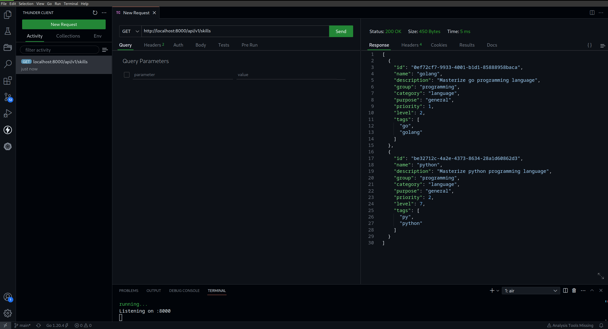
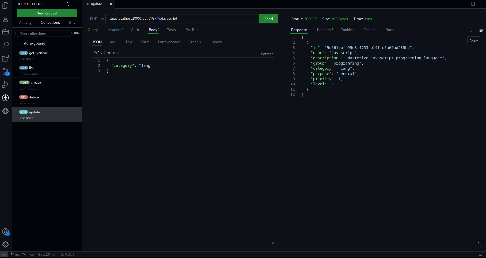
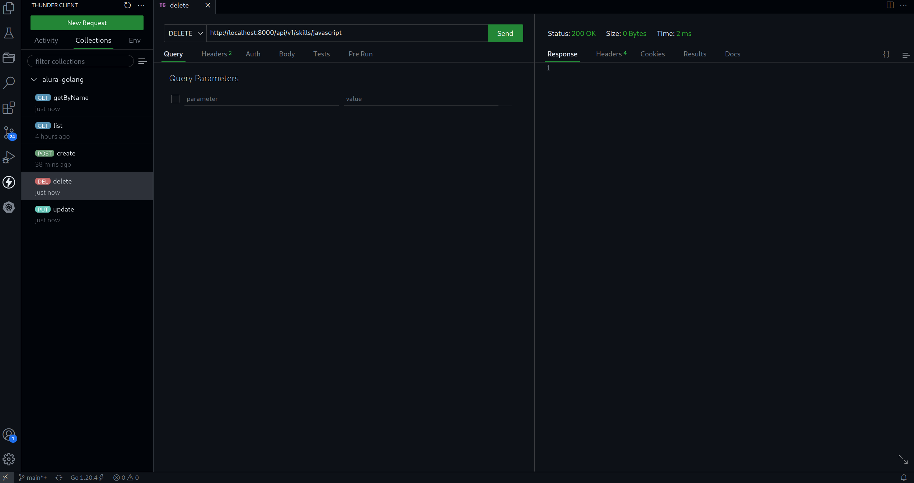

# alura-golang
Projeto desenvolvido com base nos treinamentos de Golang na plataforma Alura.


## Estrutura de pastas
```
.
├── assets
│   ├── get_skill_by_name.png
│   ├── list_skills.png
│   └── thunder-collection_alura-golang.json
├── docker
│   ├── docker-compose.yaml
│   └── Dockerfile
├── Makefile
├── migration
│   └── docker-database-initial.sql
├── README.md
└── src
    ├── controllers
    │   └── controllers.go
    ├── go.mod
    ├── go.sum
    ├── main.go
    ├── models
    │   └── skills.go
    └── routes
        └── routes.go
```


## Modo de uso
```
## faça o build da imagem
make build

## suba os containers via docker-compose
docker-compose -f docker/docker-compose.yaml up -d
```


## CRUD
### List skills


### Get skill by name


### Update skill


### Delete skill



### Temas abordados
- API REST: net/http
- Roteator HTTP: gorilla/mux
- ORM: gorm


## O que fiz de diferente
- Entidade principal skill
- CLI air, para live-reloading
- Collection para o ThunderClient
- Makefile
- Dockerfile
- String de conexão sendo composta por variáveis de ambiente, ao invés de uma string pura
- Rota /api/v1/healthz
- Campo ID do tipo UUID
- Busca por nome da skill, ao invés do ID
